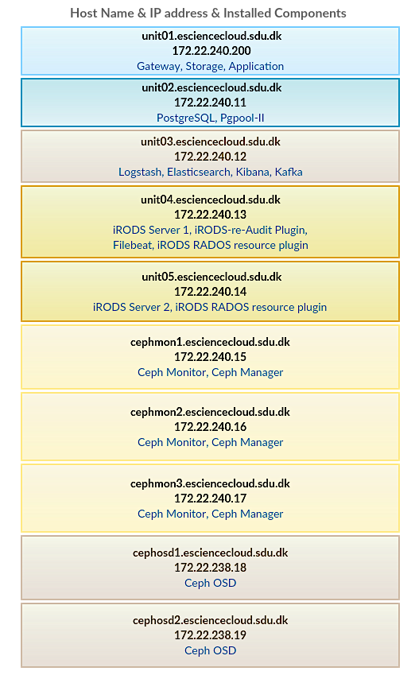

.. _Ansible:

Ansible
========
We installed components against HPC nodes by ansible, which is an radically simple IT automation engine.

Ansible Installation
--------------------

We installed EPEL first before installing Ansible.

.. code-block:: yml

   sudo yum install epel-release

And then install Ansible.

.. code-block:: yml

   sudo yum install ansible

Ansible Inventory Configuration
--------------------------------

Ansible works against multiple HPC nodes in our infrastructure at the same time. It does this by selecting portions of the HPC nodeslisted in Ansible’s inventory, which locates at ``/etc/ansible/hosts``. The configuration for our Ansible's inventory is shown as bellow.

.. code-block:: yml

   [web]
   web.esciencecloud.sdu.dk
   [index]
   index.esciencecloud.sdu.dk
   [db]
   db.esciencecloud.sdu.dk
   [irods]
   irods[1:2].esciencecloud.sdu.dk
   [ceph-mon]
   cephmon[1:3].esciencecloud.sdu.dk
   [ceph-osd]
   cephosd[1:2].esciencecloud.sdu.dk

Check where all the components are installed against the HPC nodes.

For more information on our ansible installation and configuration, please refer to `<https://github.com/SDU-eScience/Ansible>`_
