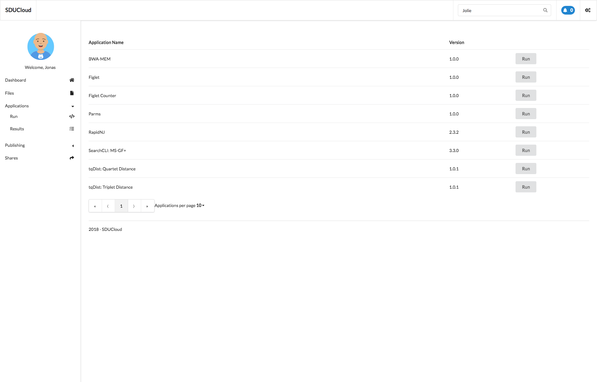
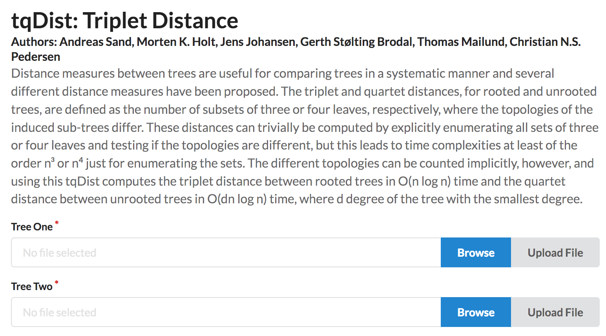

.. _App-service:

Applications
================================================================================

* **Running version:** 0.2.0
* **Depends on:** :ref:`service-common`, :ref:`auth-service`,
  :ref:`storage-service` 

Summary
--------------------------------------------------------------------------------

Applications in SDUCloud are "containerized" [#]_ pieces of software run on
High-Performance Computing (HPC) [#]_. All applications are ready to use, no
configuration is required by the user.

TODO Application use-cases. What can you do with them?

SDUCloud connects your applications with the your data. When you run an
application, SDUCloud will take care of data transfers. This will happen both
for your input data, but also for your output data. Data transfers are secure
and logged. This makes SDUCloud applications suitable for sensitive data
analysis.

You can browse the available applications by clicking on "Applications/Run
|run-icon|".

.. [#] We use "containerization" technology for the applications. We currently
   support Docker_ (through udocker_) and Singularity_.

.. [#] The only HPC backend currently supported is 
       `ABC2.0 <https://escience.sdu.dk/index.php/hpc>`_

.. _Docker: https://www.docker.com

.. _udocker: https://github.com/indigo-dc/udocker

.. _Singularity: http://singularity.lbl.gov/

Browsing Applications
--------------------------------------------------------------------------------

SDUCloud provides a catalog of applications for you. These applications have
already been installed and are ready to run on HPC. All you need to do is
provide the input files.

   You can view a list of applications that SDUCloud provides under
   "Applications/Run |run-icon|"

When clicking the "Run" button you will be taken to a page where you provide
input parameters for the application. A demo application is provided
`here <https://cloud.sdu.dk/app/applications/tqdist_quartet/1.0.1/>`_.

Running Applications
--------------------------------------------------------------------------------

In this section we will demonstrate how to run an application. 
The application we will be running is available 
`here <https://cloud.sdu.dk/app/applications/tqdist_quartet/1.0.1/>`_.

   Input files for applications are provided after you click the 
   `"Run" <https://cloud.sdu.dk/app/applications/tqdist_quartet/1.0.1/>`_ 
   button.

The application shown has two mandatory arguments, as indicated by the "*".
It is possible to select an existing file from SDUCloud, by clicking
"Browse", or upload a new file from your own machine, by clicking "Upload
File". We have already uploaded our input files at ``Home/App Data/tqDist/``.
So we simple press "Browse" and select the files from that folder.

.. figure::  images/app-file-selector.png
   :align:   center

   Attaching input files to application.

All applications additionally have "Scheduling Parameters". These parameters
control how the application is scheduled on the HPC backend. In the case of
ABC2.0 it controls how many nodes to allocate and for how long the reservation
should hold.

You start the application by clicking the blue "Submit" button at the bottom
of the page. At this point you will be redirected to the results page. At
this point it is safe to leave the page, the job will continue in the
background.

Browsing Results
--------------------------------------------------------------------------------

At any point in time, you can browse the results of your applications. You can
access them by clicking "Applications/Results |results-icon|". From this page
you can view all completed and running applications.

Let's take a look at the application we started in the previous section. On
this page we can view the current progress of the application. At the top of
the page we can see the five stages that the application will go through. The
current step is highlighted, in this case "Scheduled". The page also contains
a section with "Standard Streams". You will see the application output in
this section, when the application is "Running".

.. figure::  images/app-running.png
   :align:   center

   An application in the Slurm [#]_ queue of ABC2.0

A new section will appear after job completion. This shows the output files.
The output files of the job were automatically transferred from the HPC
environment and back into SDUCloud. It is also possible to go directly to the
output directory in your SDUCloud.

   An application that has finished running.

.. [#] Slurm is the job scheduler of ABC2.0

.. Creating Applications

   TODO

.. |run-icon| image:: images/icons/code.svg
   :height: 16px
   :target: https://cloud.sdu.dk/app/applications

.. |results-icon| image:: images/icons/tasks.svg
   :height: 16px
   :target: https://cloud.sdu.dk/app/analyses

