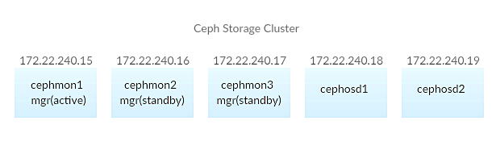
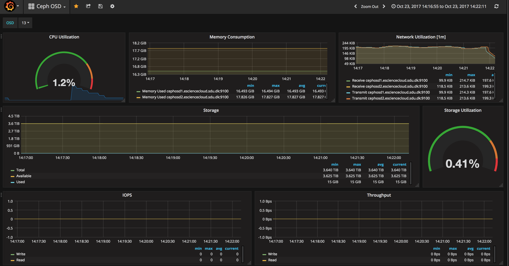

.. _Ceph:

Ceph
====

Ceph Overview
-------------

Ceph is an open-source, massively scalable, software-defined storage system which provides object, block and file system storage from a single clustered platform.

Ceph Storage Cluster
--------------------
Ceph storage cluster deployments begin with setting up each Ceph Node, network and the Ceph Storage Cluster. A Ceph Storage Cluster requires at least one Ceph Monitor and at leasttwo Ceph OSD Daemons. Our Ceph storage cluster includes five nodes - three nodes for ceph monitors and two nodes for ceph OSDs. Additional, three ceph-mgrs have been set up on each of the nodes which is running a ceph-mon daemon. By default, whichever ceph-mgr instance comes up first will be made active by the monitors, and the others will be standbys. The following shows the information of our ceph storage cluster.

Ceph Installation
-----------------
We used ansible to install Ceph through repository channels. That meant we got Ceph installed through a new repository. It is managed by the ``ceph_origin`` variable. If ``ceph_origin`` is set to ``repository``, you have to choose which repository you want to download Ceph. It is controlled by the ``ceph_origin`` variable. In our case we used ``community`` option, which fetched packages from `the official community Ceph repositories <http://download.ceph.com>`_.

Ceph Configuration
-------------------
Before installing ceph, we created our inventory file, playbook and configuration for our ceph storage cluster.

Inventory
^^^^^^^^^
The ansible inventory file defines the hosts in our cluster and what roles each host plays in our Ceph cluster. Inventory file related to Ceph installation looks like:

.. code-block:: yml

   [ceph-mon]
   cephmon[1:3].esciencecloud.sdu.dk

   [ceph-osd]
   cephosd[1:2].esciencecloud.sdu.dk

Playbook
^^^^^^^^
We had our ``site.yml`` playbook to pass to the ``ansible-playbook`` command when deploying our Ceph storage cluster. It locates at the root of ``ansible-ceph`` folder. This playbook installs dependencies like ``python2``, defines deployment design and assigns roleto server groups. The roles assigned to mons server looks like:

.. code-block:: yml

   - hosts: mons
   gather_facts: false
   become: True
   roles:
     - ceph-defaults
     - ceph-common
     - ceph-mon

The configuration for our Ceph storage cluster was set by the use of ansible variable. All of these variables are defined in ``group_vars/`` directory. Part of our configuration that deploys ``luminous`` version of Ceph with OSDs looks like this:

.. code-block:: yml

   ceph_origin = repository
   ceph_repository = community
   ceph_stable_release: luminous
   monitor_interface: eno49
   osd_scenario: non-collocated

For more information on our Ceph ansible playbooks please refer to `<https://github.com/SDU-eScience/eScienceCloud/tree/master/ansible/playbooks/ansible_ceph>`_

Prometheus Plugin and Grafana
^^^^^^^^^^^^^^^^^^^^^^^^^^^^^

The ceph prometheus plugin provides a Prometheus exporter to pass on Ceph performance counters from the collection point in ceph-mgr. The exported data can be queried from Grafanawhich allows us to query, visualize, alert on the ceph metrics. The following shows an example Grafana dashboard which queries Prometheus for ceph data.

iRODS RADOS Resource Plugin
---------------------------
This iRODS plugin implements a direct access to Ceph/rados in the most efficient manner. Files in the iRODS namespace are mapped to objects in the rados key-blob store. In contrast to other plugins, the irados resource plugin does not need to cache or stage files, but gives you direct and parallel access to data. Internally, the plugin maps the POSIX like open, read, write, seek, unlink, stat, and close calls to the librados client's operations. To fully use the inherent rados cluster parallelity, irods files are split to multiple 4 MB files and uploads of large files open multiple parallel transfer threads.

