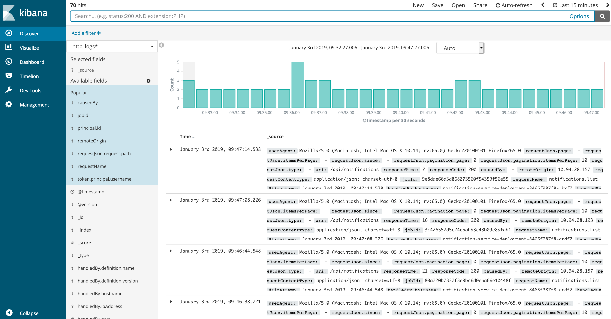

.. _Elastic_Stack:

Elastic Stack
==============
.. _Logstash:

Logstash
---------
Logstash processes logs.

.. _Elasticsearch:

Elasticsearch
--------------
Elasticsearch stores logs.

.. _Kibana:

Kibana
--------------
Kibana is a web interface for searching and visualizing logs.

Elastic Stack Installation
--------------------------
* Server 
  
  Elastic Stack is installed on the :ref:`[index] server`.

* Version

  6.1.0

* Dependencies
  
  Java 8

.. note:: 
   For more information on Elastic Stack installation, please refer to
   `<https://www.elastic.co/guide/en/elasticsearch/reference/current/_installation.html>`_
   `<https://www.elastic.co/guide/en/logstash/current/installing-logstash.html>`_
   `<https://www.elastic.co/guide/en/kibana/current/install.html>`_

* Playbook
  
  ``elk.yml`` is the playbook for the Elastic Stack installation.

.. note::
   For more information on our Elastic Stack installation, please refer to `<https://github.com/SDU-eScience/Ansible/blob/master/elk.yml>`_

Elastic Stack Configuration
----------------------------
Logstash configuration
^^^^^^^^^^^^^^^^^^^^^^^
Logstash configuration file is in the JSON format. It is in our case called ``audit.conf`` and  locates at ``/etc/logstash/conf.d``. It has three defined sections - ``ínput``, ``filter`` and ``output``.

* The input section configures Logstash to read the messages from the "beats" queue.
* The date filter parses dates from [msg][ts] fields, and then timestamp as UNIX_MS which is one of the logstash accepted timestamp.
* The output writes the resulting information to Elasticsearch under the "audit_log2" index.
* The stdout writes the resulting output in an easily readable format to the stdout. This can be commented out once debugging is finished.

The Logstash configuration file - ``audit.conf`` is shown as below.

.. code-block:: yml

   input {
     beats {
       port => 5044
       codec => "json"
           }
         }
   filter {
     date  {
       match => ["[msg][ts]", "UNIX_MS"]
           }
         }
   output {
     elasticsearch {
       hosts => "localhost:9200"
       manage_template => false
       index => "audit_log2"
          }
     stdout {
       codec => rubydebug {}
            }
          }

Kibana configuration
^^^^^^^^^^^^^^^^^^^^^
Forward the port 5601 from your local terminal if you want to access Kibana web portal with ``http://localhost:5601`` through your local browser.

.. code-block:: bash

   ssh -L 5601:172.22.240.12:5601 username@130.225.164.200 -N

Access Kibana web portal with ``http://localhost:5601`` and click the ``audit_log2`` index on the left side. The Kibana dashboard for monitoring our iRODS grid looks like the following.

   :align:   center

Elastic Stack Client
=====================
.. _Filebeat:

Filebeat
---------
Filebeat is installed on the iRODS servers. It ships audit logs which generated from :ref:`iRODS-Re-Audit plugin` to Logstash.

Filebeat Installation
----------------------
* Server

  Filebeat is installed on the :ref:`[irods] server`.

* Version

  6.1.0

* Dependencies

  Java 8 and Java 9 is not supported. 

.. note::
   For more information on Elastic Stack Client installation, please refer to `<https://www.elastic.co/guide/en/beats/filebeat/current/filebeat-installation.html>`_

* Playbook

``elk-client.yml`` is the playbook for the Elastic Stack Client installation.

.. note::
   For more information on our Elastic Stack Client installation, please refer to `<https://github.com/SDU-eScience/Ansible/blob/master/elk-client.yml>`_

Filebeat configuration
^^^^^^^^^^^^^^^^^^^^^^
Filebeat configuration file is in YAML format, which locates at ``/etc/filebeat/filebeat.yml``. Under paths sub section which belongs to the Filebeat prospectors section, commented out the default and added new entries to specify the path for the iRODS's log file.

.. code-block:: yml

   # Paths that should be crawled and fetched. Glob based paths.
     paths:
       - /var/lib/irods/log/audit.log*
       #- c:\programdata\elasticsearch\logs\*

Under Logstash output sub section which belongs to the Outputs section, we defined to use Logstash as the outputs when sending the iRODS's log file as data collection by the filebeat.

.. code-block:: yml

   output.logstash:
   # The Logstash hosts
     hosts: ["unit03.esciencecloud.sdu.dk:5044”]

Log shipment diagram
=====================
The following diagram illustrates how our iRODS audit log is shipped, processed, stored and visualized by using Elastic Stack and its client.

.. figure::  images/ELK-workflow.png

   :align:   center
