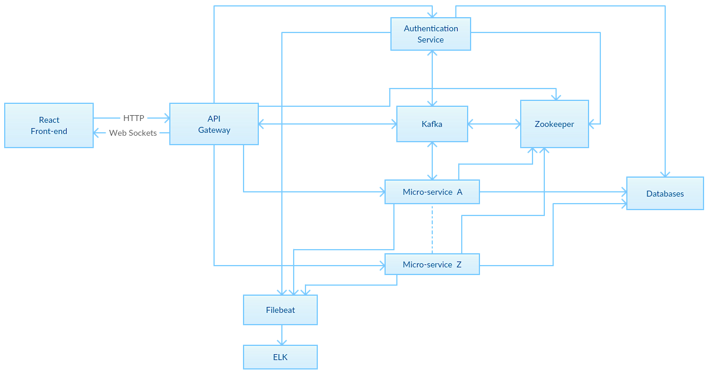

.. eScienceCloud documentation master file, created by
   sphinx-quickstart on Fri Aug 18 12:10:07 2017.
   You can adapt this file completely to your liking, but it should at least
   contain the root `toctree` directive.

Welcome to SDUCloud's documentation!
=============================================

This documentation exists to provide an introduction of the  SDUCloud. The project aims to provide easy access to national HPC infrastructures,like the Abacus 2.0 supercomputer,allowing a researcher to run complex or heavy computations on a supercomputer in a completely seamless and automatic way. 

Overview, by components
========================
* UI
 * :ref:`Ktor`
 * :ref:`React`
* Service
 * Authentication
  * :ref:`WAYF`
 * Data Management
  * :ref:`Ceph`
  * :ref:`iRODS`
  * :ref:`iRODS_Re_Audit_Plugin`
 * Data Pipline
  * :ref:`Filebeat`
  * :ref:`Elasticsearch`
  * :ref:`Logstash`
  * :ref:`Kibana`
  * :ref:`Zookeeper`
  * :ref:`Kafka`
* Database
 * :ref:`PostgreSQL`
 * :ref:`Pgpool_II`

The diagram illustrates how components connected with each other.
 

Automation
===========
* :ref:`Ansible`

.. toctree::
   :maxdepth: 2
   :caption: Contents:
   
Indices and tables
==================

* :ref:`genindex`
* :ref:`modindex`
* :ref:`search`

