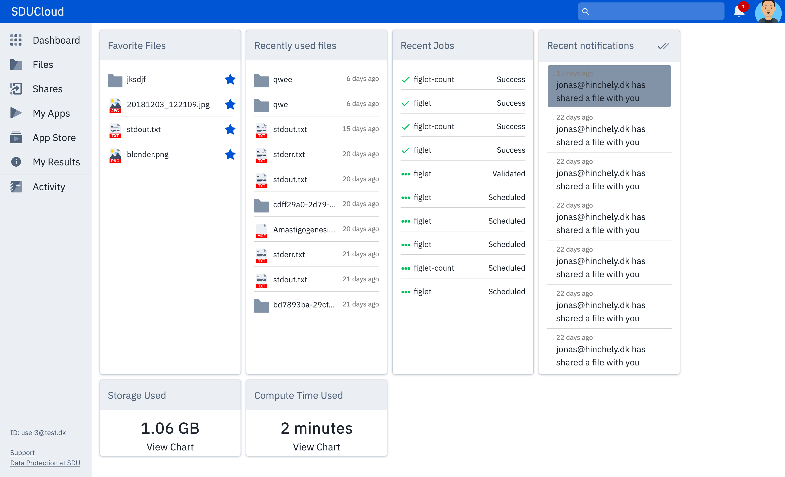

.. eScienceCloud documentation master file, created by
   sphinx-quickstart on Fri Aug 18 12:10:07 2017.
   You can adapt this file completely to your liking, but it should at least
   contain the root `toctree` directive.

Welcome to SDUCloud
=============================================

Link:
https://cloud.sdu.dk

Introduction
------------

SduCloud have been designed and programmed at the eScience Center at the University Of Southern Denmark.

The 3. party components that are being used are provided by the open source community.

The functionality follows the requirements from the NSAS description.

Scaleability have has a high priority in the design specification of the solution. This target have been reached by implementing all the "moving parts"
as micro services and a event based messaging system(Kafka).

Application Screens
====================

Dashboard
---------

This is the entrypoint of the application

Files
-----
.. figure::  images/screens/files/files.png
   :align:   center

Awaits input from Jonas

Applications
---------
.. figure::  images/screens/applications/applications_list.png
   :align:   center

At the Applications screen the user is able to see all available applications that he/she can run on Abacus2.0. If the user hover above the name of an application he/she is able to get a description of the application. If the user press the run button he/she will be forwarded to that specific application setup and are able to add the input files that he/she would like to be included in the execution of the application.

Publications
------------
.. figure::  images/screens/publications/publications.png
   :align:   center

Shares
------
.. figure::  images/screens/shares/shares.png
   :align:   center

Awaits input from Jonas

Design features
===============

Security
--------

To secure that SduCloud is GDPR compliant following design patterns have been implemented :

Access Controls
---------------

Wayf

Privileged users are proxy users so all none system users are granted the least privilege.

All duties within the system are handled by services

All transactions (frontend/backend) are authenticated by Json Web Tokens https://jwt.io/ (JSR7519) which is granted to each user session as part of the authorisation process. All transactions that are initiated through a user login can be traced.

.. figure::  images/WAYF.png
   :align:   center

Certificates
------------
Certificates have been installed on all servers.

Dataprotection
--------------

Encryption for data at rest and in motion

prevent unauthorized access, it is transparent to applications and users, it provides a strong preventive control, and modern solutions typically experience low performance impact. Additional data protection technologies include management of encryption keys, redaction of application layer data, and masking of sensitive production data for use in nonproduction environments for testing and development purposes.

Auditing/Monitoring
-------------------

All subcomponents produces logs and audit trails. Filebeat/Logstash automatically collects all log files and their data are imported into Elastic Search (ELK-stack). The presentation tool used to present the logs is "Kibana".

Automated monitoring of security and performance incidents to detect anomalous activity or behaviour including an automated escalation process including blocking of users or subcomponent if threat or odd behaviour is detected.

The Ceph cluster monitor looks like this

.. figure::  images/grafana.png
   :align:   center

An example audit log

.. figure::  images/kibana.png
   :align:   center

Open source components
======================
* :ref:`Components_of_Communication`
* :ref:`Ansible`
* :ref:`Ceph`
* :ref:`Zookeeper`
* :ref:`Kafka`
* :ref:`Filebeat`
* :ref:`Logstash`
* :ref:`Elasticsearch`
* :ref:`Kibana`
* :ref:`PostgreSQL`
* :ref:`Pgpool_II`
* :ref:`Jmeter`
* :ref:`Selenium`

Overview, by design
===================
* :ref:`Security`
* :ref:`Modularity`
* :ref:`Fault-tolerance`

   
.. toctree::
   :maxdepth: 2

   testincl.rst

Indices and tables
==================

* :ref:`genindex`
* :ref:`modindex`
* :ref:`search`

