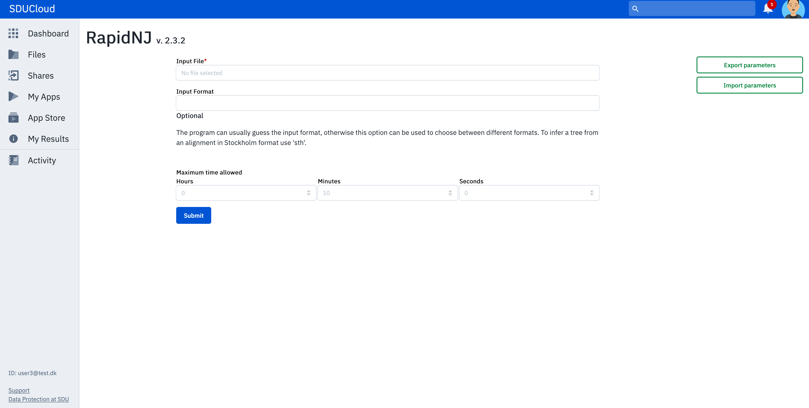
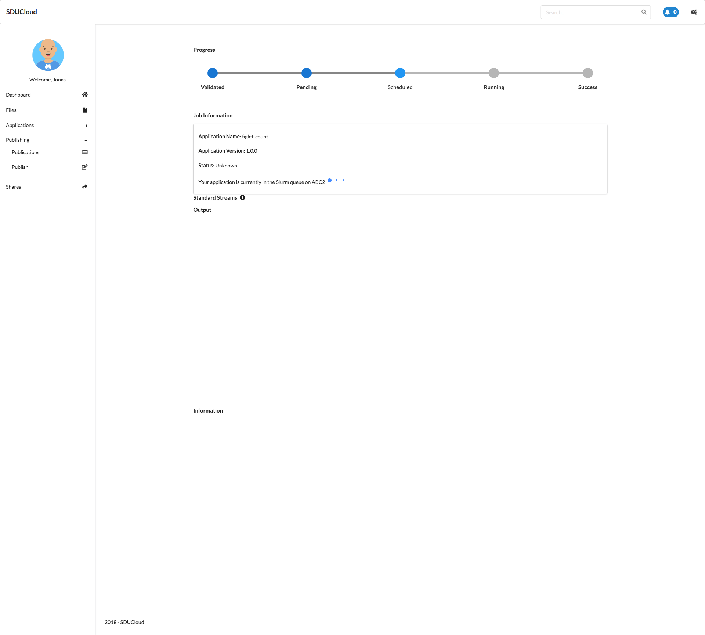
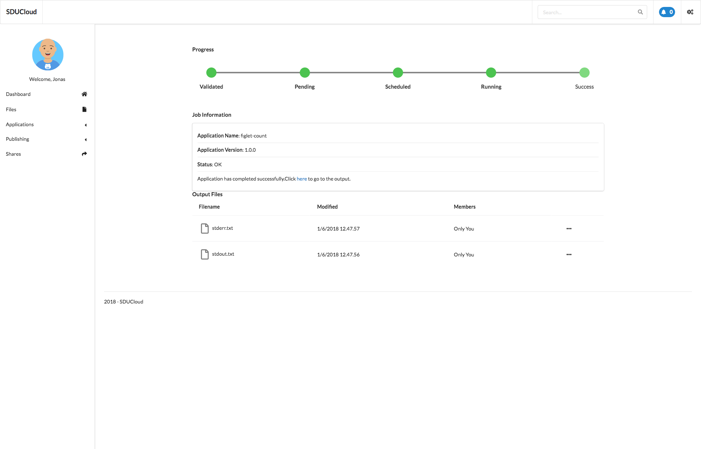
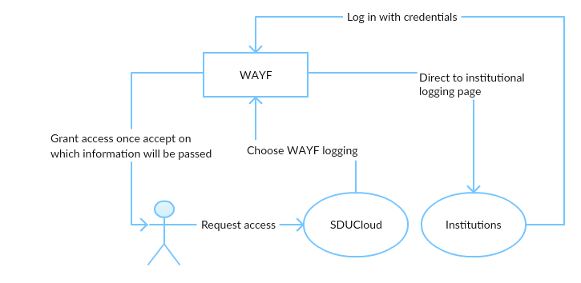

.. eScienceCloud documentation master file, created by
   sphinx-quickstart on Fri Aug 18 12:10:07 2017.
   You can adapt this file completely to your liking, but it should at least
   contain the root `toctree` directive.

Welcome to SDUCloud
=============================================

Link:
https://cloud.sdu.dk

Introduction
------------

SduCloud have been designed and programmed at the eScience Center at the University Of Southern Denmark.

The purpose is to provide a user interface that improves the usability of the HPC environment (Abacus2) for the common user. At the same time provide a data storage that secures the GDPR compliance. Meta-data can be attached to the stored files so in SduCloud. The meta-data are made searchable within the user interface.

Files can be published through the integration to Zenodo.

Its components are provided by the open source community.

The functionality follows the requirements from the NSAS description.

Scaleability has a high priority in the design specification of the solution. This target have been reached by implementing all the "moving parts" as micro services and a event based messaging broker (Kafka).

Application Screens
====================

Dashboard
---------
.. figure::  images/screens/dashboard/dashboard.png
   :align:   center

This is the entrypoint of the application and gives the user a overview of recent activity.

Files
-----
.. figure::  images/screens/files/files.png
   :align:   center

For each file presented to the user, with few exceptions1, a series of operations can be made.

This includes Uploading of files, downloading of files, showing properties for a file or folder, moving of files, copying of files, deletion of files, and sharing of files.

_Uploading of a file_ can be done by clicking the Upload Files button on the Files page, which will show a modal where the user can upload files. This can be done either by draggin the files or browsing using the OS'es native file browser. The files will be upladed to the current folder. If the file is a .tar.gz file, the uploader allows for extraction of the files.

_Download of a file_ is done by selecting a single file a folder and clicking the download button, either on the context menu, or on the file's dropdown. Downloading of a folder will be in the form of a .zip file.

_Moving files_ or _copying files_ is available in the dropdown and context menu. A modal is shown providing the available locations for the operation. The files to be moved/copied, are excluded of the possible destinations.

To _delete files_, available in the dropdown and context menu, select the files to be deleted. This will show a prompt to confirm the operation.

_Sharing of files_, available in the dropdown, context menu, and has its own button next to the dropdown, will prompt the user name and the associated rights for the user.

1. Not all functionality is available to folders Jobs, Favorites, and Trash Bin. Additionally, only folders can be projects.

Applications
---------
.. figure::  images/screens/applications/applications_list.png
   :align:   center

At the Applications screen the user is able to see all available applications that he/she can run on Abacus2.0. If the user hover above the name of an application he/she is able to get a description of the application. If the user press the run button he/she will be forwarded to that specific application setup and are able to add the input files that he/she would like to be included in the execution of the application.

When the "Run" button on the selected application is clicked

Gives the user information about how the app execution is progressing.

When the app execution has finished with success.

Publications
------------

Publishing provides tools for publishing to Zenodo. Publications will list an overview of publishings, with the possiblity of a more details for a specific upload, by clicking on the "Show More"-button. If the files for the publication have successfully been uploaded to Zenodo, "Finish publication at Zendodo" will transfer the user to Zendodo to finish the publication.

The Publish option allows the user to upload a series of files to Zenodo from SDUCloud, by selecting them and supplying a name for the publication.

Shares
------

Following either having recieved a sharing invitation or shared a file with another user, the two lists 'Shared with Me' and 'Shared by Me' will be populated.

When a file is shared, the target user, or users, will receive a notification and the Shares-page will list both files that has been shared, and invitations. They also show the rights associated with the share, being READ, WRITE, and EXECUTE. If the file has been shared, the target user can revoke the sharing of the file, and if a user has been invited, they can Accept or Reject the invitation.

For the user sending the invitation, the invitations are shown under 'Shared by Me'. The user is here able to revoke the sharing or update the rights associated with the share.

Design features
===============

Security
--------

As part of the GDPR compliance the following design patterns have been implemented:

Access Controls
---------------

Wayf

Privileged users are proxy users so all none system users are granted the least privilege.

All duties within the system are handled by micro services that acts on behalf of the logged in user according to the actual permissions that have been granted to the users role.

On the technical level all transactions (frontend/backend) are authenticated by Json Web Tokens https://jwt.io/ (JSR7519) which is granted to each user session as part of the authorisation process.

Certificates
------------
Certificates have been installed on all servers.

Dataprotection
--------------

Encryption for data at rest and in motion prevents unauthorized access, it is transparent to applications and users, it provides a strong preventive control, and modern solutions typically experience low performance impact. Additional data protection technologies include management of encryption keys, redaction of application layer data, and masking of sensitive production data for use in nonproduction environments for testing and development purposes.

Auditing/Monitoring
-------------------

All subcomponents produces logs and audit trails. Filebeat/Logstash automatically collects all log files and their data are imported into Elastic Search (ELK-stack). The presentation tool used to present the logs is "Kibana".

Automated monitoring of security and performance incidents to detect anomalous activity or behaviour including an automated escalation process including blocking of users or subcomponent if threat or odd behaviour is detected.

The Ceph cluster monitor looks like this

.. figure::  images/grafana.png
   :align:   center

An example audit log

.. figure::  images/kibana.png
   :align:   center

Open source components
======================
* :ref:`Components_of_Communication`
* :ref:`Ansible`
* :ref:`Ceph`
* :ref:`Zookeeper`
* :ref:`Kafka`
* :ref:`Filebeat`
* :ref:`Logstash`
* :ref:`Elasticsearch`
* :ref:`Kibana`
* :ref:`PostgreSQL`
* :ref:`Pgpool_II`
* :ref:`Jmeter`
* :ref:`Selenium`

Overview, by design
===================
* :ref:`Security`
* :ref:`Modularity`
* :ref:`Fault-tolerance`

   
.. toctree::
   :maxdepth: 2

Indices and tables
==================

* :ref:`genindex`
* :ref:`modindex`
* :ref:`search`

