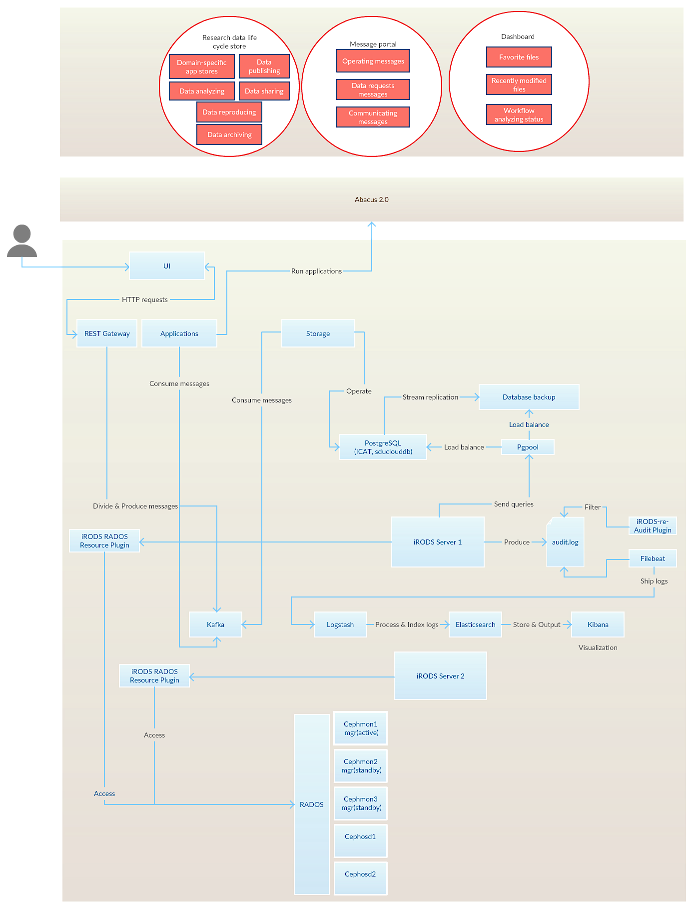
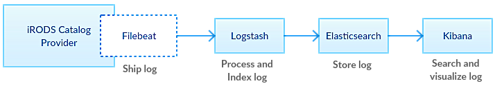
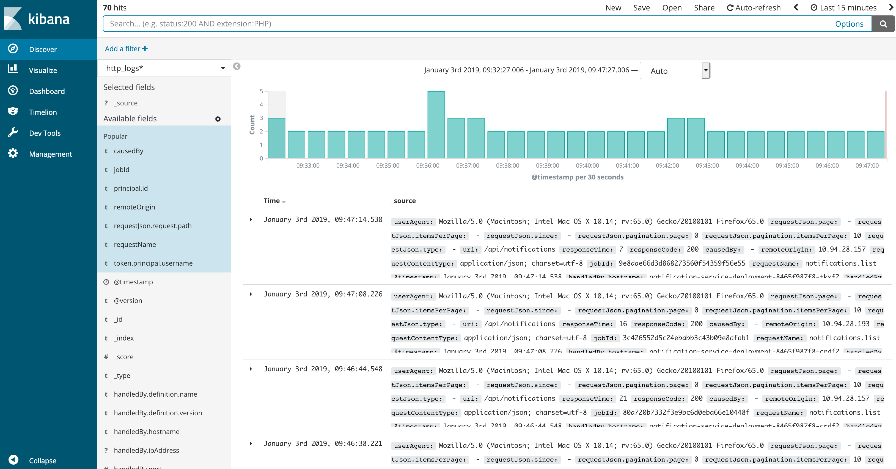
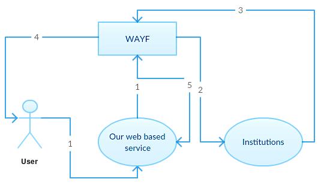

.. eScienceCloud documentation master file, created by
   sphinx-quickstart on Fri Aug 18 12:10:07 2017.
   You can adapt this file completely to your liking, but it should at least
   contain the root `toctree` directive.

Welcome to SDU eScienceCloud's documentation!
=============================================
This project was proposed by SDU eScience Center, which is structured as a competent research-based organization that has the ownership of the common research infrastructure for eScience, provides user support across the faculties and develops future e-infrastructures andservices.

The key components for this project are listed below as well as their usage descriptions, installations and configurations.

Components
==========
* :doc:`/ansible`
* :doc:`/iRODS`
* :doc:`/ceph`
* :doc:`/irods_re_audit_plugin`
* :doc:`/elastic_stack`
* :doc:`/postgreSQL_server`
* :doc:`/pgpool_II`
* :doc:`/ui`

The following diagram illustrates how components communicate with each other.
 

ansible
========
We installed components against HPC nodes by ansible, which is an radically simple IT automation engine.

ansible installation
--------------------

We installed EPEL first before installing Ansible.

.. code-block:: yml

   sudo yum install epel-release

And then install Ansible.

.. code-block:: yml

   sudo yum install ansible

ansible inventory configuration
--------------------------------

Ansible works against multiple HPC nodes in our infrastructure at the same time. It does this by selecting portions of the HPC nodeslisted in Ansible’s inventory, which locates at ``/etc/ansible/hosts``. The configuration for our Ansible's inventory is shown as bellow.

.. code-block:: yml

   [web]
   web.esciencecloud.sdu.dk
   [index]
   index.esciencecloud.sdu.dk
   [db]
   db.esciencecloud.sdu.dk
   [irods]
   irods[1:2].esciencecloud.sdu.dk
   [ceph-mon]
   cephmon[1:3].esciencecloud.sdu.dk
   [ceph-osd]
   cephosd[1:2].esciencecloud.sdu.dk

The components we have installed by Ansible accross our HPC nodes are shown as below.

.. figure::  images/installed-components.png
   :align:   center
 

For more information on our ansible playbooks please refer to `<https://github.com/SDU-eScience/eScienceCloud/tree/master/ansible/playbooks>`_

iRODS
=====

iRODS usages
------------

iRODS is an open source data management software used by research organizations and government agencies worldwide. It is a middleware which in our case sits above the Ceph filesystem and our application.

We use iRODS mainly in three ways

* Manage data objects and metadata
* Configure resource
* Secure collaboration

iRODS deployments
-----------------

Our iRODS deployment includes three key components

* an iRODS Metadata Catalog(iCAT) database
* a Catalog Provider
* a Catalog Consumer

iCAT database instance setups
-----------------------------

iRODS neither creates nor manages a database instance itself, just the tables within the database. Therefore, the database instance should be created and configured before installing iRODS. PostgreSQL is the database for us which is used to implement the iCAT database. The following PSQL was used for setting up our database.

.. code-block:: psql

   $ (sudo) su - postgres
   postgres$ psql
   psql> CREATE USER irods WITH PASSWORD 'testpassword';
   psql> CREATE DATABASE "ICAT";
   psql> GRANT ALL PRIVILEGES ON DATABASE "ICAT" TO irods;

Run ``\l`` to view the permissions.

.. code-block:: psql

    postgres=# \l

                                      List of databases
    Name   |Owner    |Encoding |Collate    |Ctype      |Access privileges   
    -------+---------+---------+-----------+-----------+-----------------------
    ICAT   |postgres |UTF8     |en_US.UTF-8|en_US.UTF-8|=Tc/postgres+
           |         |         |           |           |postgres=CTc/
           |         |         |           |           |postgres+
           |         |         |           |           |irods=CTc/p

iRODS Catalog Provider installation
-----------------------------------
We used ansible to install iRODS and the ``irods.yml`` is the playbook for our iRODS installation. It locates at the root of ansible-irods folder. There are several dependencies for installing iRODS-such dependencies as Extra Packages for Enterprise Linux (EPEL) and iRODS database plugin for future connecting iRODS with postgreSQL database. Basically to finish the installation, you have to complete the following three steps

* Install the public key and add the repository
* Install irods-server irods-database-plugin-postgres
* Upgrade all the installed packages

The following code which is included in our ``irods.yml`` shows the installation of EPEL.

.. code-block:: yml

   - name: add epel repo
     yum_repository:
      name: epel
      description: Fedora EPEL Repository
      baseurl: https://download.fedoraproject.org/pub/epel/$releasever/
               $basearch/
      gpgcheck: yes
      gpgkey: http://dl.fedoraproject.org/pub/epel/RPM-GPG-KEY-EPEL-7
      enabled: yes

iRODS Catalog Provider configuration 
------------------------------------

After installation, run ``setup_irods.py`` script to fullfil information of the iRODS Catalog Provider.

.. code-block:: bash

   $ (sudo) python /var/lib/irods/scripts/setup_irods.py

The asked information is shown as below

.. code-block:: text-only

   1. Service Account
  
   *  Service Account Name
   *  Service Account Group
   *  Catalog Service Role

   2. Database Connection

   *  ODBC Driver
   *  Database Server's Hostname or IP
   *  Database Server's Port
   *  Database Name
   *  Database User
   *  Database Password
   *  Stored Passwords Salt

   3. iRODS Server Options

   *  Zone Name
   *  Zone Port
   *  Parallel Port Range (Begin)
   *  Parallel Port Range (End)
   *  Control Plane Port
   *  Schema Validation Base URI
   *  iRODS Administrator Username

   4. Keys and Passwords

   *  zone_key
   *  negotiation_key
   *  Control Plane Key
   *  iRODS Administrator Password

   5. Vault Directory

Once a server is up and running, you can view the environment settings by running

.. code-block:: bash

   $ ienv

For more information on our iRODS ansible playbooks please refer to `<https://github.com/SDU-eScience/eScienceCloud/tree/master/ansible/playbooks/ansible_irods>`_

Ceph
====

Ceph overview
-------------

Ceph is an open-source, massively scalable, software-defined storage system which provides object, block and file system storage from a single clustered platform.

Ceph storage cluster  
--------------------
Ceph storage cluster deployments begin with setting up each Ceph Node, network and the Ceph Storage Cluster. A Ceph Storage Cluster requires at least one Ceph Monitor and at leasttwo Ceph OSD Daemons. Our Ceph storage cluster includes five nodes - three nodes for ceph monitors and two nodes for ceph OSDs. Additional, three ceph-mgrs have been set up on each of the nodes which is running a ceph-mon daemon. By default, whichever ceph-mgr instance comes up first will be made active by the monitors, and the others will be standbys. The following shows the information of our ceph storage cluster.

.. figure::  images/ceph_storage_cluster_original_crop_bright.png
   :align:   center

Ceph installation
-----------------
We used ansible to install Ceph through repository channels. That meant we got Ceph installed through a new repository. It is managed by the ``ceph_origin`` variable. If ``ceph_origin`` is set to ``repository``, you have to choose which repository you want to download Ceph. It is controlled by the ``ceph_origin`` variable. In our case we used ``community`` option, which fetched packages from `the official community Ceph repositories <http://download.ceph.com>`_.

Ceph configuration
-------------------
Before installing ceph, we created our inventory file, playbook and configuration for our ceph storage cluster.

Inventory
^^^^^^^^^
The ansible inventory file defines the hosts in our cluster and what roles each host plays in our Ceph cluster. Inventory file related to Ceph installation looks like:

.. code-block:: yml

   [ceph-mon]
   cephmon[1:3].esciencecloud.sdu.dk

   [ceph-osd]
   cephosd[1:2].esciencecloud.sdu.dk

Playbook
^^^^^^^^
We had our ``site.yml`` playbook to pass to the ``ansible-playbook`` command when deploying our Ceph storage cluster. It locates at the root of ``ansible-ceph`` folder. This playbook installs dependencies like ``python2``, defines deployment design and assigns roleto server groups. The roles assigned to mons server looks like:

.. code-block:: yml

   - hosts: mons
   gather_facts: false
   become: True
   roles:
     - ceph-defaults
     - ceph-common
     - ceph-mon

The configuration for our Ceph storage cluster was set by the use of ansible variable. All of these variables are defined in ``group_vars/`` directory. Part of our configuration that deploys ``luminous`` version of Ceph with OSDs looks like this:

.. code-block:: yml

   ceph_origin = repository
   ceph_repository = community
   ceph_stable_release: luminous
   monitor_interface: eno49
   osd_scenario: non-collocated

For more information on our Ceph ansible playbooks please refer to `<https://github.com/SDU-eScience/eScienceCloud/tree/master/ansible/playbooks/ansible_ceph>`_

Prometheus plugin and Grafana
^^^^^^^^^^^^^^^^^^^^^^^^^^^^^

The ceph prometheus plugin provides a Prometheus exporter to pass on Ceph performance counters from the collection point in ceph-mgr. The exported data can be queried from Grafanawhich allows us to query, visualize, alert on the ceph metrics. The following shows an example Grafana dashboard which queries Prometheus for ceph data.

.. figure::  images/grafana.png
   :align:   center

iRODS RADOS resource plugin
---------------------------
This iRODS plugin implements a direct access to Ceph/rados in the most efficient manner. Files in the iRODS namespace are mapped to objects in the rados key-blob store. In contrast to other plugins, the irados resource plugin does not need to cache or stage files, but gives you direct and parallel access to data. Internally, the plugin maps the POSIX like open, read, write, seek, unlink, stat, and close calls to the librados client's operations. To fully use the inherent rados cluster parallelity, irods files are split to multiple 4 MB files and uploads of large files open multiple parallel transfer threads.

irods-re-audit plugin and elastic stack
========================================

irods-re-audit plugin
----------------------

We have written an iRODs audit plugin for auditing iRODS grid. And our iRODS audit plugin improves from the `official iRODS audit plugin <https://irods.org/2016/12/auditing-irods-with-the-audit-plugin-and-elastic-stack/>`_. The official iRODS audit plugin generates messages whenever a dynamic policy enforcement point (PEP) is fired, and our iRODS audit plugin filters the messages from the messages which is generated by the official iRODS audit plugin. The outputs is stored in an rotating log file which is placed at ``/var/lib/irods/log/audit.log``. Each line of this log file contains a JSON message which is corresponding to a user's event. For example, the following JSON message is generated after executingan ``iput`` command which means that uploads a file to iRODS collection.

.. code-block:: json

   {  
   "pid":4491,
   "level":"I",
   "msg":{  
      "ts":1505731837906,
      "completed":true,
      "type":"putObject",
      "accessedBy":{  
         "username":"rods",
         "zone":"tempZone",
         "type":""
      },
      "path":"/tempZone/home/rods/imada/irods_dashboard.json"
     }
   }

The following table lists the users' actions that can be logged by our iRODS audit plugin. 

+-------------------+--------------------+--------------------------------------------------------------------------+
|iCommands          |Message type        |Description                                                               |
+===================+====================+==========================================================================+
|iput               |putObject           |Store a file into iRODS.                                                  |
+-------------------+--------------------+--------------------------------------------------------------------------+      
|iget               |objectAccessed      |Get data-objects or collections from iRODS space, either to the specified |
|                   |                    |local area or to the current working directory.                           |            
+-------------------+--------------------+--------------------------------------------------------------------------+
|iadmin mkuser      |userCreation        |Create a new iRODS user in the ICAT database.                             |           
+-------------------+--------------------+--------------------------------------------------------------------------+
|igroupadmin mkgroup|userCreation        |Create a user group.                                                      |
+-------------------+--------------------+--------------------------------------------------------------------------+
|icp                |objectAccess        |Copies an irods data-object (file) or collection (directory) to another   |
|                   |dataObjCopy         |data-object or collection.                                                |
+-------------------+--------------------+--------------------------------------------------------------------------+
|irm                |dataObjRemove       |Remove one or more data-object or collection from iRODS space.            |
+-------------------+--------------------+--------------------------------------------------------------------------+
|imv                |dataObjRename       |Moves/renames an irods data-object (file) or collection (directory) to    |
|                   |                    |another, data-object or collection.                                       |
+-------------------+--------------------+--------------------------------------------------------------------------+
|ichmod             |objectModeModified  |Modify access to dataObjects (iRODS files) and collections (directories). |       
+-------------------+--------------------+--------------------------------------------------------------------------+
|iadmin mkresc      |createResource      |Create (register) a new coordinating or storage resource.                 |
+-------------------+--------------------+--------------------------------------------------------------------------+
|imeta add          |metadataModification|Modify iRODS metadata.                                                    |
+-------------------+--------------------+--------------------------------------------------------------------------+
|imeta rm           |metadataModification|Delete iRODS metadata.                                                    |
+-------------------+--------------------+--------------------------------------------------------------------------+

For more information on our iRODS audit plugin please refer to `<https://github.com/SDU-eScience/irods-re-audit>`_

elastic stack
--------------

Elastic stack is an overall solutions which aims to reliably and securely take data from any source, in any format, and search, analyze, and visualize it in real time. It provides a collection of open source software tools and in our case we use Filebeat, Logstash, Elasticsearch and Kibana. Filebeat sends data from ``/var/lib/irods/log/audit.log`` to Logstash, which then transforms and stores them in Elasticsearch. Elasticsearch stores and indexes all the data. Finally the data can be queried and displayed graphically from Elasticsearch to Kibana.

ELK installation
-----------------
We installed the filebeat on irods nodes and logstash, elasticsearch and kibana on the index node. We had to add the Elastic repository first before installing all these components. The ansible playbook for adding the Elastic repository for index mode is shown as below.

.. code-block:: yml

   - hosts: index
     become: true
     tasks:                      
       - name: add Elastic repo
         yum_repository:
          name: Elastic repository for 5.x packages
          description: Elastic Repository
          baseurl: https://artifacts.elastic.co/packages/5.x/yum
          gpgcheck: 1
          gpgkey: https://artifacts.elastic.co/GPG-KEY-elasticsearch
          enabled: 1           
          autorefresh: 1
          type: rpm-md

After adding the Elastic repository, using the following YAML to install the filebeat, logstash, elasticsearch and kibana perspectively.

.. code-block:: yml

   - name: install filebeat
     yum:  
      name: filebeat
      state: present
       
   - name: install logstash
     yum:  
      name: logstash
      state: present
    
    - name: install elasticsearch
      yum:  
       name: elasticsearch
       state: present
       
    - name: install kibana
      yum:  
       name: kibana
       state: present
    
Updating the yum packahges after each installation

.. code-block:: yml

   - name: upgrade all packages
     yum:
      name: '*'
      state: latest

ELK configuration
------------------

filebeat configuration
^^^^^^^^^^^^^^^^^^^^^^
Filebeat configuration file is in YAML format, which locates at ``/etc/filebeat/filebeat.yml``. Under paths sub section which belongs to the Filebeat prospectors section, we commented out the default and added new entries to specify the path for the iRODS's log file.

.. code-block:: yml
   
   # Paths that should be crawled and fetched. Glob based paths.
   paths:
     - /var/lib/irods/log/audit.log*
     #- c:\programdata\elasticsearch\logs\* 

Under Logstash output sub section which belongs to the Outputs section, we defined to use Logstash as the outputs when sending the iRODS'slog file as data collection by the filebeat.

.. code-block:: yml
   
   output.logstash:
     # The Logstash hosts
     hosts: ["unit03.esciencecloud.sdu.dk:5044"] 

logstash configuration
^^^^^^^^^^^^^^^^^^^^^^^

Logstash configuration file is in the JSON format. It is in our case called ``audit.conf`` and  locates at ``/etc/logstash/conf.d``. It has three defined sections-``ínput``, ``filter`` and ``output``. 

* The input section configures Logstash to read the messages from the "beats" queue.
* The date filter parses dates from [msg][ts] fields, and then timestamp as UNIX_MS which is one of the logstash accepted timestamp.
* The output writes the resulting information to Elasticsearch under the "audit_log2" index.
* The stdout writes the resulting output in an easily readable format to the stdout. This can be commented out once debugging is finished.

The Logstash configuration file - ``audit.conf`` is shown as below.

.. code-block:: yml

   input {
     beats {
       port => 5044
       codec => "json"
     }
   }

   filter {
     date  {
       match => ["[msg][ts]", "UNIX_MS"]
     }
   }

   output {
     elasticsearch {
       hosts => "localhost:9200"
       manage_template => false
       index => "audit_log2"
     }
     
     stdout {
       codec => rubydebug {
     }
   }
   }  

kibana configuration
^^^^^^^^^^^^^^^^^^^^^

We used a Kibana dashboard to monitor our iRODS grid. The Kibana service currently is running on the index node with port 5601. So you need to forward this port from your local terminal if you want to access Kibana web portal with ``http://localhost:5601`` throug your local browser.

Forward the port 5601 from your local terminal.

.. code-block:: bash

   ssh -L 5601:172.22.240.12:5601 username@130.225.164.200 -N

Access Kibana web portal with ``http://localhost:5601`` and click the ``audit_log2`` index on the left side. The Kibana dashboard for monitoring our iRODS grid looks like the following.

postgreSQL hot standby & pgpool-II
==================================
postgreSQL hot standby & streaming replication settings
-------------------------------------------------------
We have three PostgreSQL database instances-one primary and two hot standbys. These two hot standbys are replicas of the primary so that we can run read-only queries on them. PostgreSQL provides streaming replication for the capability to continuously ship and apply the WAL XLOG records to our standby servers in order to keep them current. To set up hot standby and enable streaming replication, our configurations are shown as below.

1. create an user named replication with REPLICATION privileges

.. code-block:: psql

   $ CREATE ROLE replication WITH REPLICATION PASSWORD 'ourpassword' LOGIN

2. Set up connections and authentication on the primary server

Edit ``postgresql.conf``

.. code-block:: text-only

   listen_addresses = '*'

Edit ``pg_hba.conf``

.. code-block:: text-only

   host  replication  replication  127.0.0.1/32  trust

3. Set up the streaming replication related parameters on the primary server

Edit ``postgresql.conf``

.. code-block:: text-only
   
   # To enable read-only queries on a standby server
   # wal_level must be set to hot standby
   wal_level = hot_standby

   # Specifies the maximum number of concurrent connections
   # from standby servers or streaming base backup clients
   max_wal_senders = 5

   # Enable WAL archiving on the primary to an archive directory accessible from
   # the standby. If wal_keep_segments is a high enough number to retain the WAL
   # segments required for the standby server, this is not necessary
   archive_mode    = on
   archive_command = 'cp %p /var/lib/pgsql/archive/%f'

4. Make a base backup by copying the primary server's data directory to the standby servers

We use pg_basebackup to fetch the entire data directory of our PostgreSQL installation from the primary and placing it onto the standby server. Run pg_basebackup command asthe database superuser, in our case is postgres, to make sure the permissions are preserved. -R option creates a minimal recovery command file which is ``recovery.conf`` for standbys within their data directories in order for streaming replication.

.. code-block:: psql

   pg_basebackup -U replication -h 172.22.240.11 -p 5432 -D /var/lib/pgsql/9.6/data1 -R
   pg_basebackup -U replication -h 172.22.240.11 -p 5432 -D /var/lib/pgsql/9.6/data2 -R

5. Set up replication-related parameters, connections and authentication in the standby servers like the primary, so that the standby might work as a primary after failover

6. Enable read-only queries on the standby servers
   
   Edit ``postgresql.conf``
   
   .. code-block:: text-only
   
      hot_standby = on

7. Start postgreSQL in the standby servers. It will start streaming replication.

pgpool-II
----------
pgpool-II is a middleware that works between PostgreSQL servers and a PostgreSQL database client. It takes an advantage of the replication feature to reducethe load on each PostgreSQL server by distributing SELECT queries among multiple servers, improving system's overall throughput.

pgpool installation
--------------------

pgpool configuration
---------------------
The pgpool-II user account
^^^^^^^^^^^^^^^^^^^^^^^^^^^
Add a Unix user account to run pgpool-II. The user name is pgpool.

.. code-block:: bash

   $ (sudo) useradd pgpool

Configuring pcp.conf
^^^^^^^^^^^^^^^^^^^^
PCP commands are UNIX commands which manipulate pgpool-II via the network. A PCP user and password for us has been declared in ``pcp.conf`` in ``/etc`` directory. A user postgres and its associated password has been written as one line using the following format:

.. code-block:: text-only
   
   postgres:[md5 encrypted password]

[md5 encrypted password] can be produced with the pg_md5 command. The following command used to generate the md5 encrypted password for postgres user for us.

.. code-block:: bash

   $ pg_md5 your_password
   1060b7b46a3bd36b3a0d66e0127d0517

Configuring pgpool.conf
^^^^^^^^^^^^^^^^^^^^^^^
In pgpool-II we use streaming replication mode which means that PostgreSQL servers operates streaming replication. And load balancing is possible in this mode. We reuse the sample configuration file for streaming replication mode from pgpool-II installation. The file is located in ``/etc/pgpool.conf.sample-stream``. The main part of our pgpool configrations is shown as below.

* connection settings

  .. code-block:: text-only
     
     # '*' accepts all incoming connections 
     listen_addresses = '*'
     
     # The port number used by pgpool-II to listen for connections    
     port = 9999                          
     
     # The directory where the UNIX domain socket accepting connections     
     # for pgpool-II will be created
     socket_dir = '/var/run/postgresql/'      
     
     # '*' accepts all incoming connections
     pcp_listen_addresses = '*'                
     
     # The port number used by PCP process to listen for connections
     pcp_port = 9898
    
     # The directory where the UNIX domain socket accepting connections
     # for pgpool-II will be created                   
     pcp_socket_dir = '/var/run/postgresql/'  

* running mode settings

  To enable ``streaming replication mode`` in pgpool-II, we have to firstly turn on ``master_slave_mode`` which is used to couple pgpool-II with another master/slave replication
  software in our case is ``streaming replication``, which PostgreSQL server is responsible for doing the actual data replication. 

  .. code-block:: text-only

     # Setting to on enables the master/slave mode
     master_slave_mode = on
     
     # Suitable for PostgreSQL's built-in streaming replication function
     master_slave_sub_mode = 'stream'      

* backend settings

  We have three backends which pgpool communicates with. And they all needs to be specified by some parameters.

  .. code-block:: text-only

     # Host name or IP address to connect to for backend 0     
     backend_hostname0 = 'localhost'        
     
     # Port number for backend 0
     backend_port0 = 5432                  
     
     # Weight for backend 0 (only in load balancing mode)     
     backend_weight0 = 1
     
     # Data directory for backend 0                    
     backend_data_directory0 = '/data'

     # Controls various backend behavior
     # ALLOW_TO_FAILOVER or DISALLOW_TO_FAILOVER      
     backend_flag0 = 'ALLOW_TO_FAILOVER'    

     backend_hostname1 = 'localhost'        
     backend_port1 = 5433                   
     backend_weight1 = 1                   
     backend_data_directory1 = '/data1'     
     backend_flag1 = 'ALLOW_TO_FAILOVER'    
                                         
     backend_hostname2 = 'localhost'
     backend_port2 = 5434                   
     backend_weight2 = 1                    
     backend_data_directory2 = '/data2'     
     backend_flag2 = 'ALLOW_TO_FAILOVER'    
                                           

* load balancing settings
  
We enabled load balancing so that pgpool-II could send the writing queries to the primay node, and other queries got load balanced among all backend nodes. To which node the load balancing mechanism sends read queries is decided at the session start time and will not be changed until the session ends. For more information on which query should be sent to which node in load balancing in streaming replication mode, please refer to `<http://www.pgpool.net/docs/latest/en/html/runtime-config-load-balancing.html>`_.

UI
==========
WAYF login
-----------
We used WAYF service for connecting between our web based service and many provided institutions. The following image shows that how WAYF interacts between our web base service and the connected institutions. 

1. The user accesses our web based service which requires a login. The user is directed to the WAYF website, where the user selects his/her institution.
2. If the user is not already logged in, the user is transferred to the institution’s login page which he/she has been selected.
3. After the user has logged into the institution, data about the user is sent to WAYF.
4. The WAYF website displays the user which personal data will be forwarded to our web based service. The user gives his/her consent by clicking on a button. And the user can tick a box to denote that this consent may be remembered for future visits to the same web based service. 
5. WAYF sends the data to our web based service. If our web based service can approve the user on the basis of this data, access is granted.

Ktor
----
Ktor is a framework for quickly creating web applications in Kotlin with minimal effort.

.. toctree::
   :maxdepth: 2
   :caption: Contents:
   
Indices and tables
==================

* :ref:`genindex`
* :ref:`modindex`
* :ref:`search`

