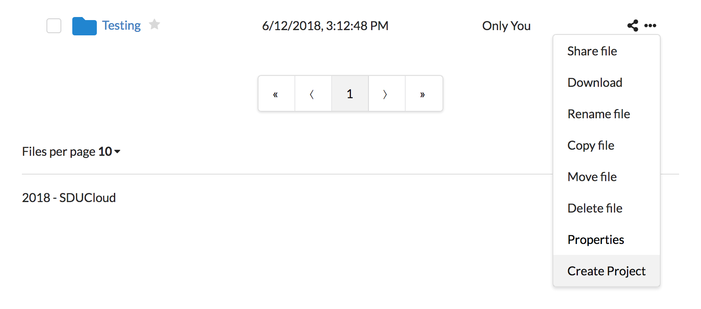
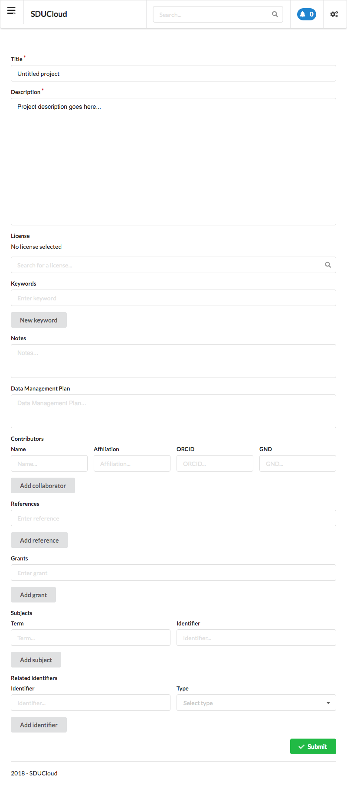
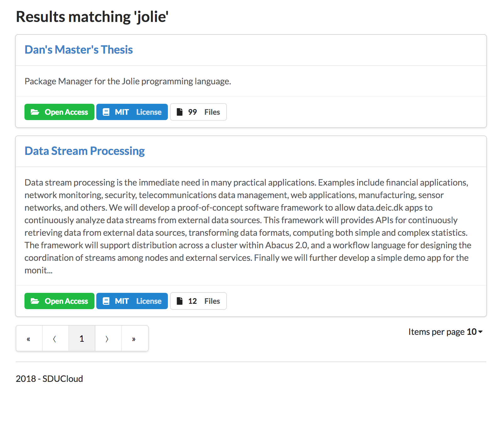
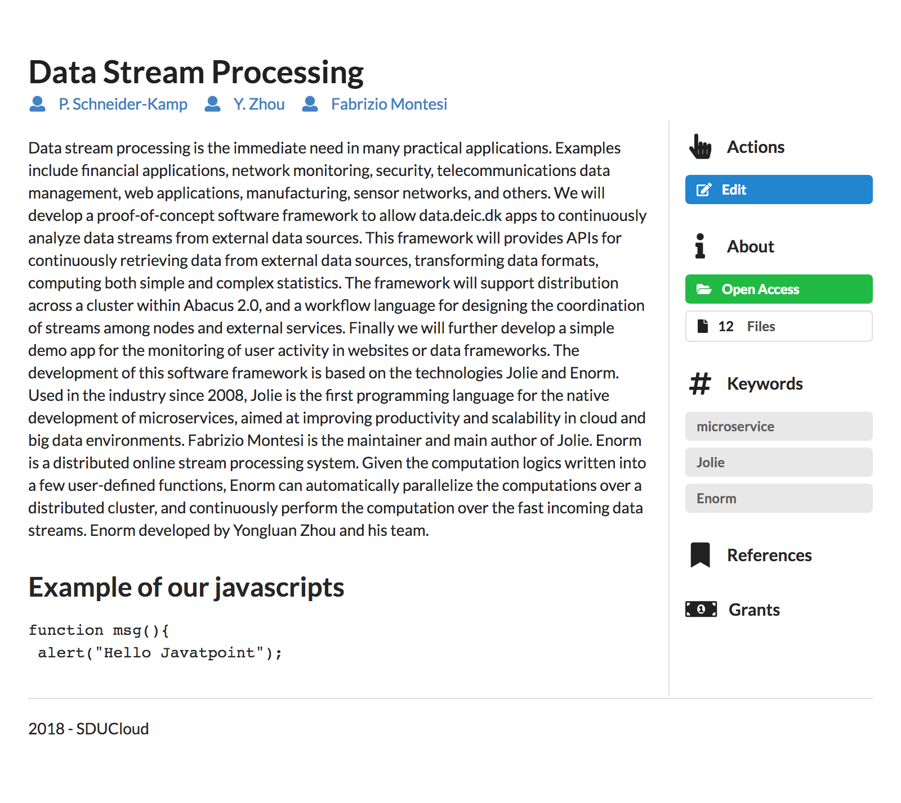

.. _Metadata-service:

Data Discovery in SDUCloud
================================================================================

* **Running version:** 1.0.0
* **Depends on:** :ref:`auth-service`, :ref:`storage-service`, 
  :ref:`service-common`

Summary
--------------------------------------------------------------------------------

SDUCloud has built in data discovery. It is possible to make any directory,
and all of its contents, searchable. It is up to the individual user to mark
a directory as discoverable. At this point the user can attach metadata to
the directory. This metadata is stored in a format similar to Datacite_ [#]_.
The metadata is used when publishing (see :ref:`zenodo-service`) datasets to
a Datacite format [#]_.

.. _Datacite: https://www.datacite.org/

.. [#] Datacite is a format for describing publications. The data discovery
   feature in SDUCloud describes live data (data that changes). As a result
   some attributes present in Datacite are left out.  Examples of
   this are publication date and other inherently immutable attributes.

.. [#] Currently a work in progress.

Marking a Directory as Discoverable
--------------------------------------------------------------------------------

You can mark any directory as discoverable by selecting "Create Project" in
the context menu of a directory:

   Marking a directory as discoverable with the "Create Project" option.

Following this you will be presented with a form, where you can edit the 
metadata associated with your "Project". The metadata shown here will be made
searchable by others automatically.

   Editing the metadata of a project. Accessible by clicking "Edit" in the
   Actions pane of a project.

Searching for Data
--------------------------------------------------------------------------------

It is possible to search for data at any point by accessing the "Search
|search-icon|" action at the top of the page.

From here we can search, and the data from the complete metadata document will
be searched for any matches. You will be presented with a list of results:

   Data discovery search results

It is possible to click any of the results for a more complete description
of the data.

   Details for a project

.. |search-icon| image:: images/icons/search.svg
   :height: 16px
   :target: https://cloud.sdu.dk/app/metadata/search/query

