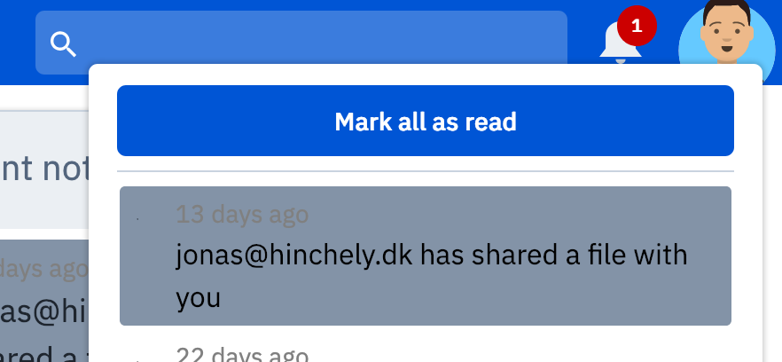

.. _Notification-service:

Notifications
================================================================================

* **Running version:** 0.2.0
* **Depends on:** :ref:`auth-service`, :ref:`service-common`

Summary
--------------------------------------------------------------------------------

In the top right corner the user will find "Notifications |notification-icon|".
The number indicates how many unread notifications there are. It is possible
to click any of the notifications to read more about them.

.. |notification-icon| image:: images/icons/bell.svg
   :height: 16px
   :target: https://cloud.sdu.dk/app