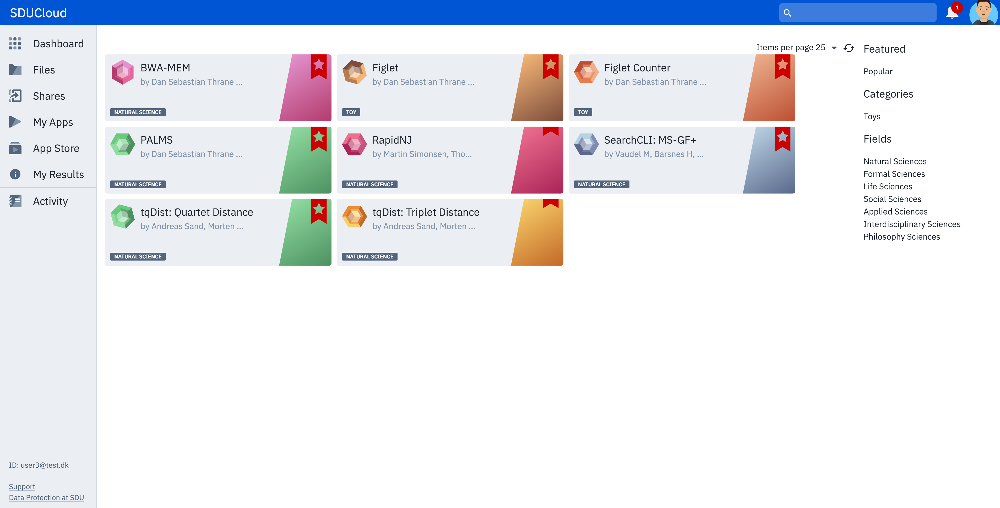
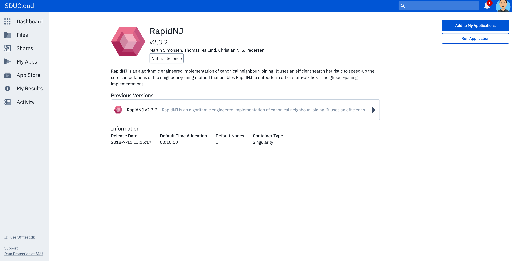
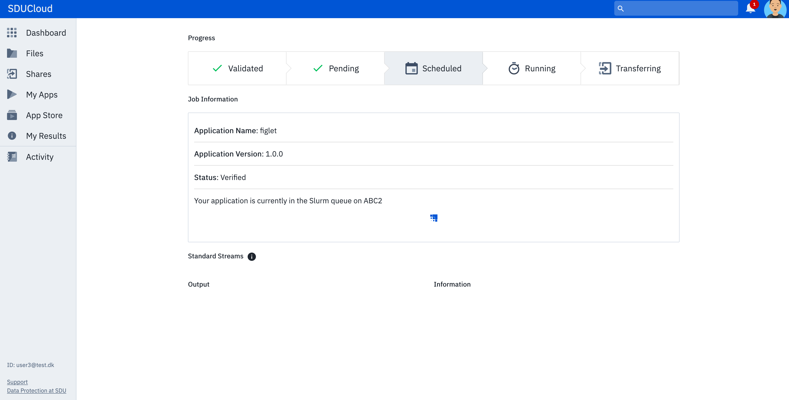

.. _quickstart:

Quick Start
================================================================================

Introduction
--------------------------------------------------------------------------------  

The purpose of SDUCloud is to provide a user interface that improves the
usability of the HPC environment (ABACUS 2.0) for the common user. It also
serves as a data storage where the user can store their data in compliance
with GDPR.

The goal of this quick start is to show the user how to:

- Login to SDUCloud
- Navigate SDUCloud
- Upload/download files
- Run applications

Login
--------------------------------------------------------------------------------

To login to SDUCloud the user will have to use WAYF (Where Are You From). This makes it
possible for all users affiliated with a danish educational institution to login
without having a separate user for SDUCloud. All they need is the login that
they use at their own institution. 

Once the users credentials are approved they will always be forwarded to
the dashboard of SDUCloud.

Navigation 
--------------------------------------------------------------------------------

No matter where the user is located at SDUCloud, the menu
will always be located in the left side of the screen. If used in a small
window or on a smaller screen, such as a mobile or tablet, the menu will
collapse but can still be unfolded by using the menu button in the top left
corner.

.. figure::  images/screens/dashboard/NavigationBar.png
  :height: 150px
  :align:   center

The menu navigates to the seven main parts of SDUCloud:

- Dashboard
	- Home screen of SDUCloud
- Files
	- Navigate your filesystem
- Shares
  - Navigate files that have been shared with the user.
- My Applications
	- Run applications.
- App Store
	- Browse all available applications and add them to "My Application" for easy access.
- My Results
  - Show your results from the applications you have run.
- Activity
  - Gives you an overview of all acitivties regarding your files. 

Dashboard
--------------------------------------------------------------------------------

The dashboard is the home screen of SDUCloud.  

.. figure::  images/screens/dashboard/dashboard.png
   :align:   center

The Dashboard is showing 6 columns: "Favorite Files", "Recently Used
Files", "Recent Jobs", "Recent Notifications", "Storage Used", and "Compute Time Used".

In "**Favorite Files**", the user can add a file to "favorites" which makes
it easier to find when having to use it for several different purposes. The
"**Recently Used Files**", show files that the user have used earlier. This
is sorted by time so that the most recently used is at top. The
"**Recent Jobs**" contains links to applications that the user have
executed within the Application section. The "**Recent Notifications**" shows the 
notfications that have been recieved by the user. Unread notifications will be
highlighted. By using the checkmark in the upper right corner the user marks all the 
notifications as read.
"**Storage Used**" shows the user how much storage they are currently using. And finally
"**Compute Time Used**" shows the user how much time he/she have used on computations. Both storage 
and compute time have the abilltiy to show a chart of how the user have used his/hers resources
over time.

In the top right corner the user will find :ref:`notification-service`:

.. figure::  images/screens/notifications/notifications.png
   :align:   center

Here the user will be notified when another user have shared a file with
them, or if one of their applications have finished running and have returned
with results.

Uploading Files
--------------------------------------------------------------------------------

To upload a file, the user should move to the files part of SDUCloud using the
menu. The page should look something like this

.. figure::  images/screens/files/files.png
   :align:   center

In the right side there is the possibility to create a new folder, upload a
file or search. If create a folder is selected, a new folder appears and a name can be
given to to the folder.  If the upload files is selected, the user will be
prompted with the upload dialog window.

.. figure::  images/screens/files/upload_with_no_file.png
   :align:   center

Here the user can either drag-and-drop a file or use the browse option to
browse their computer. The user is able to upload one or more files, or a
".tar.gz" or a ".zip" file that either can be extracted once uploaded or simply choose 
to upload the file as an archive. The files will be uploaded to the
current folder.

.. figure::  images/screens/files/upload_with_file.png
   :align:   center

Once a file have been uploaded it will be available to the user. If the file is
selected, a number of options becomes available for the user in the right side
of the screen. These options includes:

- Move
- Copy
- Rename
- Move to Trash
- Download
- Share
- Properties

These options are also available, in the file dropdown even if the file is
not selected.

.. figure::  images/screens/files/dropdown_menu.png
   :align:   center

It is also possible for the user to add a file or folder to their favorites
by hovering above the file/folder and clicking the small start next to the
name of the file/folder.

When a file or a folder is moved to trash, it is not deleted. To do this, the user 
should navigate to the trash folder in their home folder. Here they will be able to
empty their trash and thereby delete the files/folders for good.

Browsing for an Application
--------------------------------------------------------------------------------

By clicking "**App Store**" in the menu, the user is shown the catalogue of applications
available on SDUCloud. By using the filter options on the right side, the user can limit
their possiblities. Once the user have found the wanted application, is it possible to add the 
application to "**My Apps**" for easy access in the future. This is done by hovering above
the small bookmark on each application and clicking it. Now the bookmark is 
constantly shown to indicate that this is an application that has been added to "**My Apps**".

To get further infomation about an application, the user can click on it and they will
be shown a more detailed view of the application. Here it will also be possible for 
the user to find older versions of the application, should it be needed. It is also 
possible for the user to add the application to "**My Apps**" by using the 
"**Add to My Apps**" button.

Running an Application
--------------------------------------------------------------------------------

There are two ways of running an application. Either the user can go to the detailed 
view of an application and push the "**Run Application**" button on the right side. Or the
user can run it directly from "**My Apps**" if they have added it already.
Before the application can be run the user is asked to fill in the require infomation
or input files. Usually the application comes with default values for time limitations.
Even though it is possible to give the application more time, keep it close to what 
you think the applications really needs, since the scheduler at ABACUS 2.0 uses these 
values to schedule efficiently. 
Giving the application more than it need might postpone your job unnecessary.

.. figure::  images/screens/applications/run_application.png
  :align:   center

Once the application have been started, the user is forwarded to the progress view 
of that specific job. This can also be found by clicking on the job under "**Recent Jobs**" 
on the Dashboard or in the "**My Results**" section of the menu. 
Once the job have completed, a link to the result files will be available
in the progress view.

Download
--------------------------------------------------------------------------------

To download a file/folder either mark the file or click on the file dropdown and
choose download. If a folder is chosen a .zip file will be generated for
download. 

Logout
--------------------------------------------------------------------------------

To perform a logout from SDUCloud. Simply click the avatar in the top right
corner an choose logout.

Congratulations! You now have the knowledge to access SDUCloud, manage your
files and running applications from SDUCloud.  
Be sure to check out these other available features on SDUCloud:

Learn More
-------------------------------------------------------------------------------

* Share files with your colleagues on SDUCloud: :ref:`storage`
* Take a peek behind the curtains and learn about the internals of SDUCloud: 
  :ref:`technical-overview`