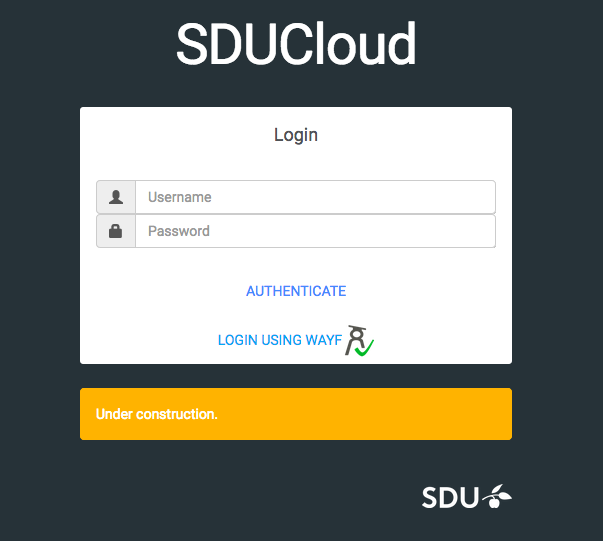

.. _quickstart:

Quick Start
================================================================================

Introduction
--------------------------------------------------------------------------------  

The purpose of SDUCloud is to provide a user interface that improves the
usability of the HPC environment (ABACUS 2.0) for the common user. It also
serves as a data storage where the user can store their data in compliance
with GDPR.

The goal of this quick start is to show the user how to:

- Login to SDUCloud
- Navigate SDUCloud
- Upload/download files
- Run applications

Login
--------------------------------------------------------------------------------

To login to SDUCloud there are two options. One is to use WAYF. This makes it
possible for all users affiliated with a danish educational institution to login
without having a separate user for SDUCloud. All they need is the login that
they use at their own institution. The other option is to login using a username
and a password connected to SDUCloud.

Once the users credentials are approved they will always be forwarded to
the dashboard of SDUCloud.

Navigation 
--------------------------------------------------------------------------------

No matter where the user is located at SDUCloud, the menu
will always be located in the left side of the screen. If used in a small
window or on a smaller screen, such as a mobile or tablet, the menu will
collapse but can still be unfolded by using the menu button in the top left
corner.

The menu navigates to the five main parts of SDUCloud:

- Dashboard
	- Home screen of SDUCloud
- Files
	- Navigate your filesystem
- Applications
	- Run applications
	- Show results
- Publishing
	- Publications
	- Publish new publication
- Shares
	- Navigate files that have been shared with the user.

Dashboard
--------------------------------------------------------------------------------

The dashboard is the home screen of SDUCloud.  

.. figure::  images/screens/dashboard/dashboard.png
   :align:   center

The Dashboard is showing 3 columns "Favorite Files", "Recently used
Files", "Recent Analyses".

In "**Favorite Files**", the user can add a file to "favorites" which makes
it easier to find when having to use it for several different purposes. The
"**Recently used Files**", show files that the user have used earlier. This
is sorted by time so that the most recently used is at top Finally the
"**Recent Analyses**" contains links to applications that the user have
executed within the Application section.

In the top right corner the user will find :ref:`notification-service`:

.. figure::  images/screens/notifications/notifications.png
   :align:   center

Here the user will be notified when another user have shared a file with
them, or if one of their applications have finished running and have returned
with results.

Uploading Files
--------------------------------------------------------------------------------

To upload a file, the user should move to the files part of SDUCloud using the
menu. The page should look something like this

.. figure::  images/screens/files/files.png
   :align:   center

In the right side there is the possibility to create a new folder or upload a
file. If create a folder is selected, a new folder appears and a name can be
given to to the folder.  If the upload files is selected, the user will be
prompted with the upload dialog window.

Here the user can either drag-and-drop a file or use the browse option to
browse their computer. The user is able to upload one or more files, or a
single ``.tar.gz`` file that either can be extracted once uploaded or simply
upload the ``.tar.gz`` as the file it is. The files will be uploaded to the
current folder.

.. figure::  images/screens/files/upload_with_file.png
   :align:   center

Once a file have been uploaded it will be available to the user. If the file is
selected, a number of options becomes available for the user in the right side
of the screen. These options includes:

- Move
- Copy
- Rename
- Delete
- Download
- Share

These options are also available, in the file dropdown even if the file is
not selected.

.. figure::  images/screens/files/dropdown_menu.png
   :align:   center

It is also possible for the user to add a file or folder to their favorites
by hovering above the file/folder and clicking the small start next to the
name of the file/folder.

Running an Application
--------------------------------------------------------------------------------

By clicking the Applications tab in the menu, a submenu appears.
If the user chooses "Run" they will be shown a list of possible applications 
that are available to be run on the HPC environment (ABACUS 2.0).

.. figure::  images/screens/applications/applications_list.png
   :align:   center

If the user hover above the name of an application he/she is able to get a
description of the application. If the user press the run button he/she will be
forwarded to that specific application setup and are able to add the input files
that he/she would like to be included in the execution of the application.

.. figure::  images/screens/applications/run_application.png
   :align:   center

Once the user submits the application, a page is shown with the progress of the
application. The applications usually have default values for the fields
"Number of nodes", "Tasks per node", "Hours", "Minutes" and "Seconds". Even
though it is possible to give the application more nodes or time, keep it close
to what you think the applications really needs, since the scheduler at ABACUS
2.0 uses these value to schedule efficiently. Giving the application more than 
it need might postpone your job unnecessary

.. figure::  images/screens/applications/detailed_result_in_queue.png
   :align:   center

Once the application is done the output files will be shown as part of the
progress page.

.. figure::  images/screens/applications/detailed_result_finished.png
   :align:   center

It is possible to access the progress page either by clicking on "Results" under
the Applications menu tab, the "Jobs" folder in Files or on the dashboard in the
list "Recent Analyses".
 

Download
--------------------------------------------------------------------------------

To download a file/folder either mark the file or click on the file dropdown and
choose download. If a folder is chosen a .zip file will be generated for
download. 

Logout
--------------------------------------------------------------------------------

To perform a logout from SDUCloud. Simply click the cogwheels in the top right
corner an choose logout.

Congratulations! You now have the knowledge to access SDUCloud, manage your
files and running applications from SDUCloud.  
Be sure to check out these other available features on SDUCloud:

Learn More
-------------------------------------------------------------------------------

* Make your data discoverable and search for other user's data: 
  :ref:`Metadata-service`
* Share files with your colleagues on SDUCloud: :ref:`Storage-service`
* Publish your work on Zenodo: :ref:`Zenodo-service`
* Go in depth with applications: :ref:`app-service`
* Take a peek behind the curtains and learn about the internals of SDUCloud: 
  :ref:`technical-overview`