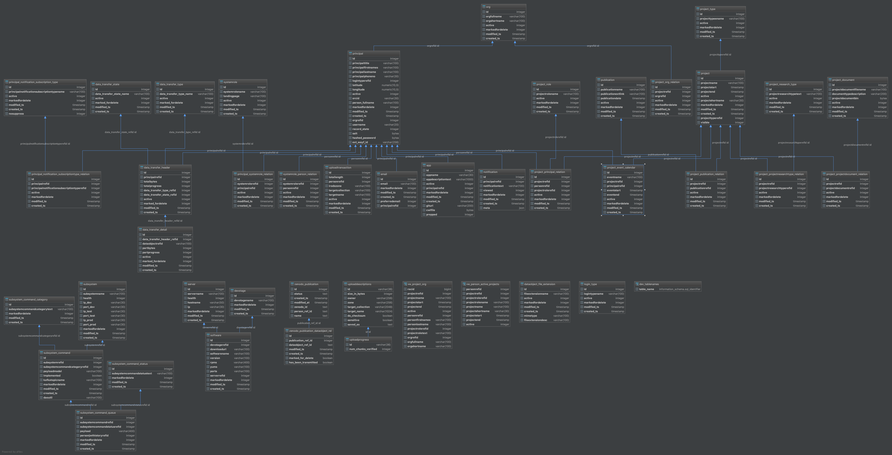

.. _Sduclouddb:

Sduclouddb
==============

Version
-------

2.0

Description
-----------

SduCloud has one single database that holds users as well other tables that will be used in futute iterations of SduCloud.

The table principal
-------------------

create table principal
(
	id serial not null
		constraint principal_pkey
			primary key,
	principaltitle varchar(100),
	principalfirstnames varchar(100),
	principallastname varchar(100),
	principalphoneno varchar(30),
	logintyperefid integer,
	latitude numeric(10,5),
	longitude numeric(10,5),
	active integer default 1,
	orcid varchar(30),
	person_fullname varchar(100),
	markedfordelete integer default 0,
	modified_ts timestamp default ('now'::text)::timestamp without time zone not null,
	created_ts timestamp default ('now'::text)::timestamp without time zone not null,
	orgrefid integer
		constraint fk_principal_org
			references org,
	username varchar(20),
	record_state integer default 1 not null,
	salt bytea,
	hashed_password bytea,
	ext_wayf_id varchar(256)
)
;

create unique index idx_logintype_id
	on principal (id)
;

create unique index idx_person_id
	on principal (id)
;

create unique index idx_person_username_unique
	on principal (username)
;

Er_diagram
----------

