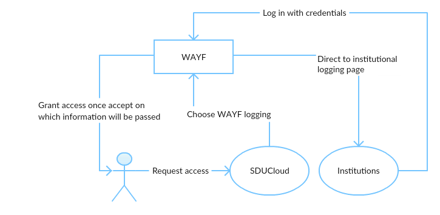

.. _Security:

Security
=========

Authentication
--------------
.. _WAYF:

WAYF (Where Are You From)
~~~~~~~~~~~~~~~~~~~~~~~~~~

WAYF is a Single Sign-On system which permits using one single login to
access several Web based services (`<http://www.wayf.dk/>`_). It creates
connection between our application and many provided institutions.

Only persons who are associated with an institution that uses WAYF can log on
our application.

The user can only be authenticated to access our application when their
institutional credentials - username and password are verified by the
institutions.

The following diagram illustrates that how WAYF interacts between our
application and the connected institutions.



   :align:   center


.. _JWT:

JWT (JSON Web Tokens)
``````````````````````

JSON Web Tokens are an open, industry standard (`RFC 7519
<https://tools.ietf.org/html/rfc7519>`_) method for representing claims
securely between two parties (`<https://jwt.io/>`_).

In our application, when the user successfully logs in using their
credentials, a JWT will be returned and saved. Whenever the user wants to
access a service, the JWT will be sent to the service in the authorization
header using the Bearer schema. The service checks for a valid JWT in the
authorization header, and if it's present, the user will be allowed to access
the service.


Authorization
-------------
Roles and Permissions
-------------

* Principal Investigator (PI)
* Member
* Admin
* Data Facilitator

File Sensitivity Level
----------------------

* Open Access
* Confidential 
* Sensitive


Kafka
``````

Our application consists of microservices, which use Kafka Streams API - a
Java library to transform events into real-time data pipeline.


Prometheus Plugin and Grafana
``````````````````````````````

The Ceph Prometheus plugin provides a Prometheus exporter to pass on Ceph
performance counters from the collection point in Ceph-mgr. The exported data
can be queried from Grafanawhich allows us to query, visualize, alert on the
Ceph metrics.

.. figure::  images/grafana.png
   :align:   center

Confidentiality
----------------
ACLs (Access Control Lists)
```````````````````````````
* Owner
* Read
* Write
