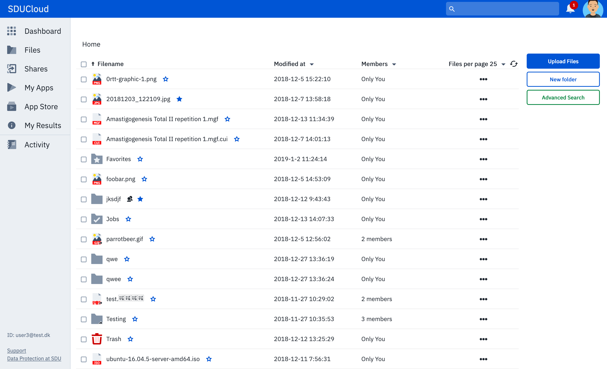

.. _Storage-service:

Storage
================================================================================

* **Running version:** 0.4.0
* **Depends on:** :ref:`auth-service`, :ref:`notification-service`, 
  :ref:`service-common`
* **Technical tests:** :ref:`storage-service-test`

Summary
--------------------------------------------------------------------------------

The storage feature is the core feature that SDUCloud provides. In this article
we will discover the storage features that are provided by the system.

Navigating Files and Common File Operations (Upload, Copy, Delete, Rename, Move)
--------------------------------------------------------------------------------

To upload a file, the user should move to the files part of SDUCloud using the
menu. The page should look something like this

In the right side there is the possibility to create a new folder or upload a
file. If create a folder is selected, a new folder appears and a name can be
given to to the folder.  If the upload files is selected, the user will be
prompted with the upload dialog window.

.. figure::  images/screens/files/upload_with_no_file.png
   :align:   center

Here the user can either drag-and-drop a file or use the browse option to browse
their computer. The user is able to upload one or more files, or a single tar.gz
file that either can be extracted once uploaded or simply upload the tar.gz as 
the file it is. The files will be uploaded to the current folder.

.. figure::  images/screens/files/upload_with_file.png
   :align:   center

Once a file have been uploaded it will be available to the user. If the file is
selected, a number of options becomes available for the user in the right side
of the screen. These options includes:

- Move
- Copy
- Rename
- Delete
- Download
- Share

These options are also available, in the file dropdown even if the file is not selected. 

.. figure::  images/screens/files/dropdown_menu.png
   :align:   center

It is also possible for the user to add a file or folder to their favorits by 
hovering above the file/folder and clicking the small start next to the name 
of the file/folder.

Sharing Files
--------------------------------------------------------------------------------

TODO Write this section

Data Discovery
--------------------------------------------------------------------------------

It is also possible to make your data discoverable by other users, and to search
for data made discoverable. This is discussed here: :ref:`metadata-service`.

Data Publishing
--------------------------------------------------------------------------------

It is possible to publish your datasets directly from within SDUCloud to
Zenodo_. You can read about this here: :ref:`zenodo-service`.

.. _Zenodo: https://zenodo.org