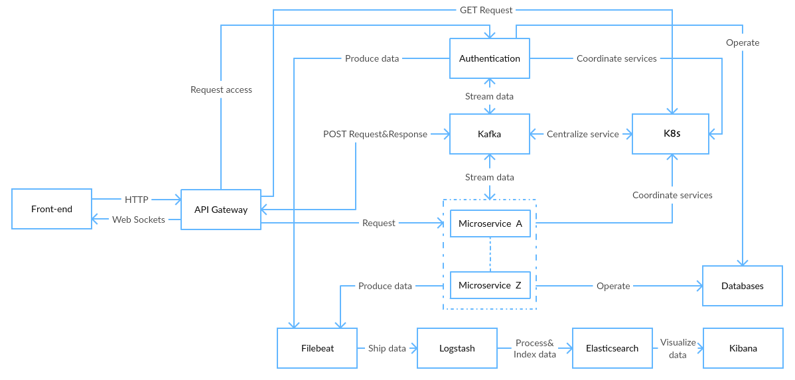
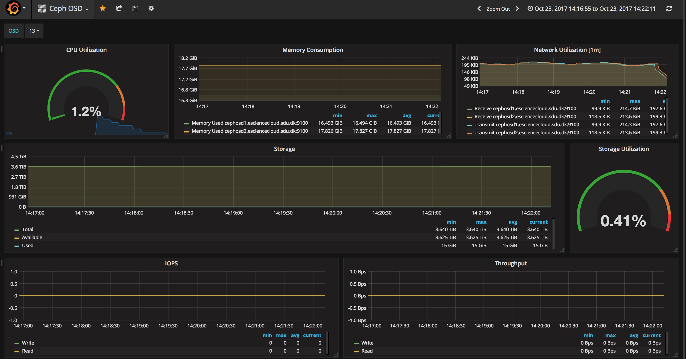

.. _technical-overview:

Technical Overview of SDUCloud
================================================================================

SDUCloud is, at its core, a system for handling massive amounts of research
data. Because of this, **scalability** has been a key concern right from the
start. SDUCloud has been built from the ground up to avoid having scalability
issues and having **no single point-of-failure**, to minimize any potential
downtime.

The backend, which powers SDUCloud, has been designed with a microservice
architecture. A microservice architecture allows us to deliver a scalable
solution with little to no down time. The backend is built on top of
**open-source components** that follow the same philosophy.

   Overall architecture of communication in SDUCloud

We use Ceph_ as our storage back-end. Ceph is an object store that provides
distributed and scalable storage with no single point-of-failure. It has been
used by CERN to handle double digit petabytes of data [#]_.

For data discovery we use Elasticsearch_. Elasticsearch is a distributed
search and analytics engine. Like Ceph and SDUCloud built to be a highly
reliable system. Elasticsearch has been used in many large systems for
free-text search, for example, it powers the search features of Wikimedia
[#]_ [#]_.

We use Kafka_ for stream processing and it helps us enable loosely-coupled
communication between microservices. Having microservices be loosely-coupled
is what helps us achieve better scalability. Kafka has been used by various
large companies, for example, it has been used by the New York Times to store
and distribute published content [#]_.

Kafka is also used as our backbone for all logging. All file activities are
automatically sent through Kafka, and then shipped, through Logstash_, into
Elasticsearch. We use the analytics functionality of Elasticsearch to, in
real-time, monitor the health of SDUCloud. Using Grafana_ and Kibana_ we are
able to visualize the data.

   Real time monitoring of Ceph using Grafana

.. figure::  images/kibana.png
   :align:   center

   Real time monitoring of SDUCloud using Kibana

.. [#] https://ceph.com/community/new-luminous-scalability/
.. [#] https://www.elastic.co/elasticon/2015/sf/navigating-through-worlds-encyclopedia
.. [#] The developers of Wikipedia_
.. [#] https://open.nytimes.com/publishing-with-apache-kafka-at-the-new-york-times-7f0e3b7d2077

.. _Ceph: https://ceph.com
.. _Elasticsearch: https://www.elastic.co/products/elasticsearch
.. _Wikipedia: https://wikipedia.org
.. _Kafka: https://kafka.apache.org
.. _Grafana: https://grafana.com/
.. _Kibana: https://www.elastic.co/products/kibana
.. _Logstash: https://www.elastic.co/products/logstash