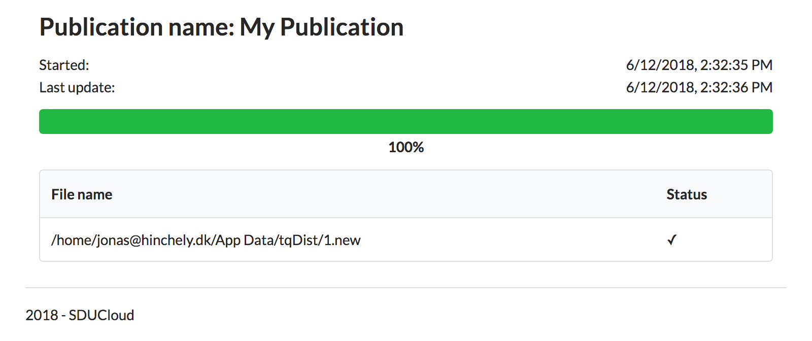

.. _Zenodo-service:

Data Publishing with Zenodo
================================================================================

* **Running version:** 1.0.0
* **Depends on:** :ref:`auth-service`, :ref:`storage-service`, 
  :ref:`service-common`

Summary
--------------------------------------------------------------------------------

SDUCloud supports publishing your data sets directly to Zenodo. When the data
is been uploaded to Zenodo you will be notified and from there it is possible
to enter additional metadata about your datasets. For more information see
the website of Zenodo_.

.. _Zenodo: https://zenodo.org

On Wikipedia_, Zenodo is described as:

    Zenodo is a research data repository. It was created by OpenAIRE and CERN
    to provide a place for researchers to deposit datasets. It launched in
    2013, allowing researchers in any subject area to upload files up to 50
    GB.

.. _Wikipedia: https://en.wikipedia.org/wiki/Zenodo

You can create a new publication by going to
"Publishing/Publish |publish-icon|".

Creating a new Publication
--------------------------------------------------------------------------------

From the publish_ page you can add the desired files. It is possible to
upload more files by pressing the "Add file" button. It is required that you
add a publication name, this will be the name of your publication on Zenodo.
When you are finished press the "Upload files" button.

.. figure:: images/zenodo-publish.png
   :align: center

   A publication in progress.

.. _publish: https://cloud.sdu.dk/app/zenodo/publish

Viewing the Status of Publications
--------------------------------------------------------------------------------

It is possible to view the status of uploads to Zenodo by clicking on
"Publishing/Publications |publications-icon|". On this page we can view a list
of all the publications we have made:

   A list of data set transfers between SDUCloud and Zenodo.

Here we can see that "My Publication" has completed. We can finish the
publication on Zenodo by clicking the "Finish publication at Zenodo" button.
Your data set will wait for you there until you finish the publication, no
publication is made public before you finish it on the Zenodo webpage. We can
also see additional information about the data transfer, for example for
ongoing transfers, by clicking "Show More".

   Our data set has been successfully transferred to Zenodo.

.. |publish-icon| image:: images/icons/edit.svg
   :height: 16px
   :target: https://cloud.sdu.dk/app/zenodo/publish

.. |publications-icon| image:: images/icons/newspaper.svg
   :height: 16px
   :target: https://cloud.sdu.dk/app/zenodo/publish